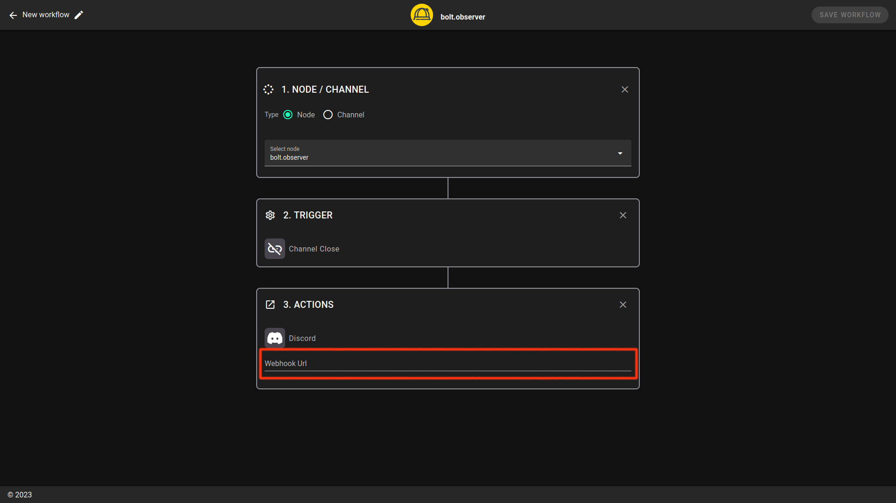

# Discord

Discord's built-in Webhooks function to get automated messages and data updates sent to a text channel in your server. More details can be found on [Discord](https://support.discord.com/hc/en-us/articles/228383668-Intro-to-Webhooks)'s support website.

### Discord configuration

Open your channel settings by clicking on the ⚙️ icon

Click on Integrations and create a webhook

If necessary, change the name of your webhook, and don't forget to save changes.

After clicking on “Copy Webhook URL”, your webhook will be saved into your clipboard.

### Integration in bolt.observer

Paste into “Webhook URL”

<figure><figcaption></figcaption></figure>

The new alert is now ready. To make sure the integration works properly, click and test and you will receive the following message in your channel or as a DM.

