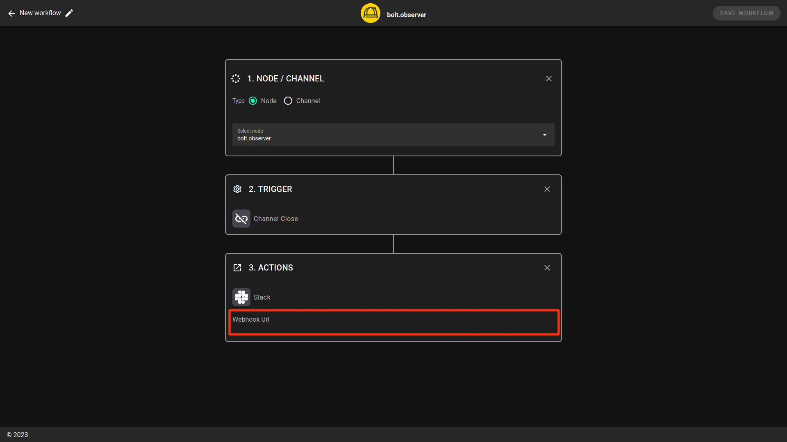

# Slack

To receive notifications on Slack, you first have to set up incoming webhooks on Slack as described [here](https://slack.com/help/articles/115005265063-Incoming-webhooks-for-Slack).

### Create a new Slack app

Select the workspace in which you prefer to receive notifications.

In the menu “Basic Information”, select Incoming Webhooks.

Toggle "**Activate Incoming Webhooks**"

Click on “**Add new webhook to Workspace**” and grant permission to access your Slack workspace

Note: notifications can be received either in a channel or as a direct message

Once the access is granted, you can copy the webhook URL and insert it into the Slack integration window in the workflow.&#x20;

<figure><figcaption></figcaption></figure>

The new alert is now ready.&#x20;
