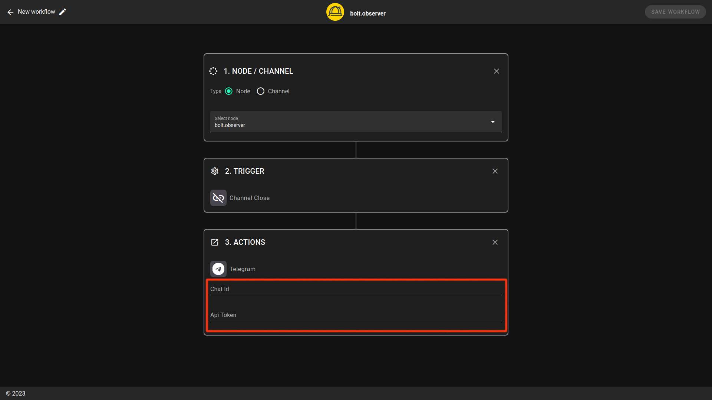

# Telegram

### # Prerequesites

To receive alerts from our platform on telegram you need to create a [new bot on telegram](https://core.telegram.org/bots#6-botfather) (or use an existing one).

### # Setup

You are now invited to enter the bot\_key (token) and chat ID given during the bot creation.

<figure><figcaption></figcaption></figure>

⚠️Warning: The ID required to connect to [bolt.observer](http://bolt.observer/) is the chat ID, and it shouldn't be confused with the participants' ID.

⚠️Warning: The chat id format is a string of numbers. Example: -1001674000166

⚠️Warning: Make sure you include all characters after “:”. In the example above, “-” must be included

Once your workflow is saved, it appears with other workflows that had previously been configured.

