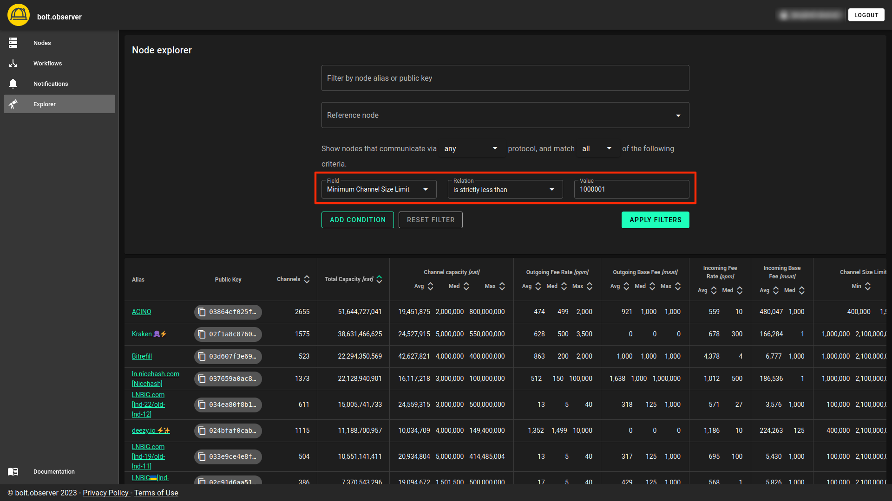
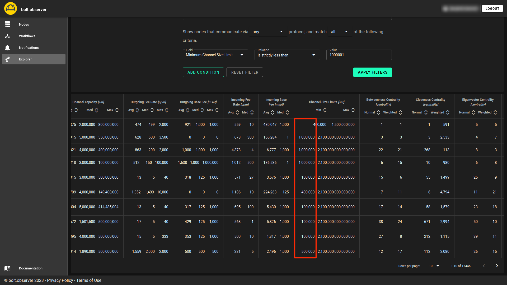
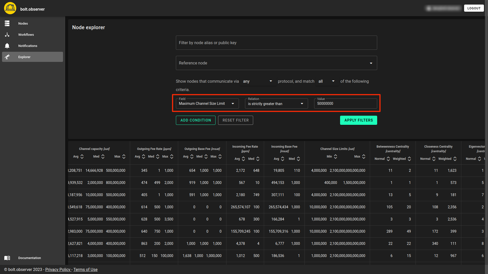
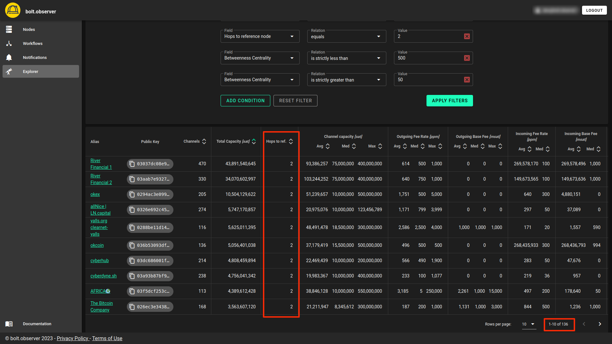

# Explorer: advanced search

[Explorer](https://bolt.observer/explorer) has been designed to assist you in exploring the Lightning Network by allowing highly granular searchese. With a wide range of search criteria, it provides you with the ability to delve deep into the network and discover nodes that align with your needs.

The entire list of search criteria can be found [here](../../bolt.observer/explorer.md).

###

### Example 1: Minimum channel size limit

In some cases, larger lightning nodes impose size limits on incoming channels. If you are interested in opening a channel with highly connected nodes, Explorer provides you with valuable information beforehand, allowing you to assess the risk of potential rejection before proceeding. This ensures that you can make an informed decision and minimize the chances of facing channel opening rejections.

<figure><figcaption></figcaption></figure>

#### Result

This is a screenshot of all the nodes whose minimum channel size limit is lower or equal to 1,000,000 sats. &#x20;

<figure><figcaption></figcaption></figure>

### Example 2: Maximum channel size limit

The same principles apply for **Maximum channel size limit**&#x20;

<figure><figcaption></figcaption></figure>

### Example 3: Capacity, latency, position, Betweenness centrality&#x20;

Find nodes with the following criteria:&#x20;

* **capacity** > 1BTC
* **latency** < 1500 ms
* **number of hops** = exactly at 2 hops away from your node
* 50 < **Betweenness Centrality** < 500

<figure><figcaption></figcaption></figure>

#### Results

<figure><figcaption></figcaption></figure>

