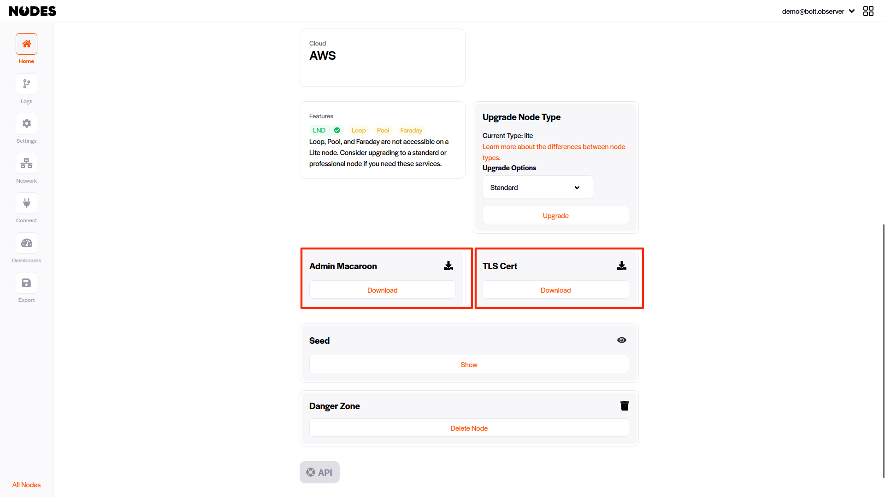
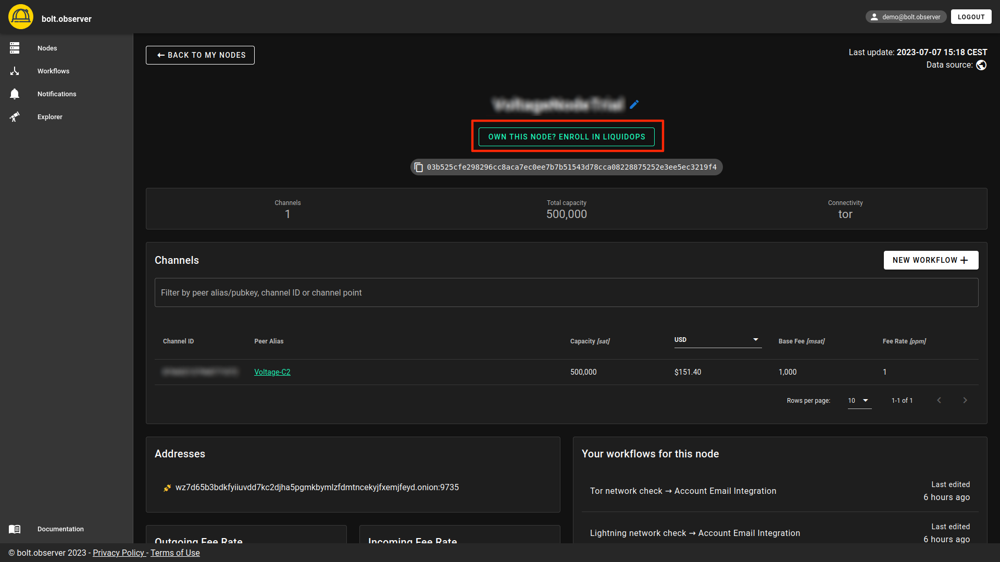
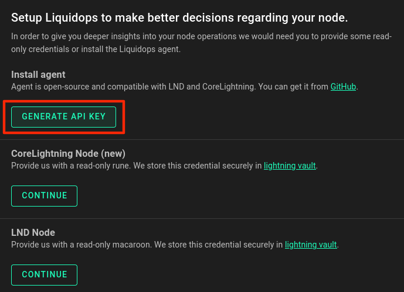
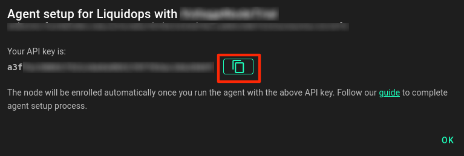
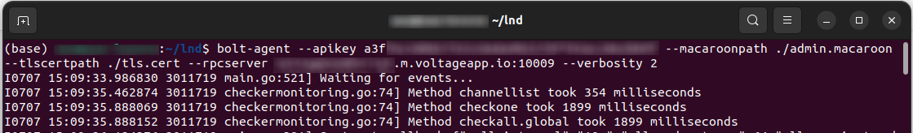
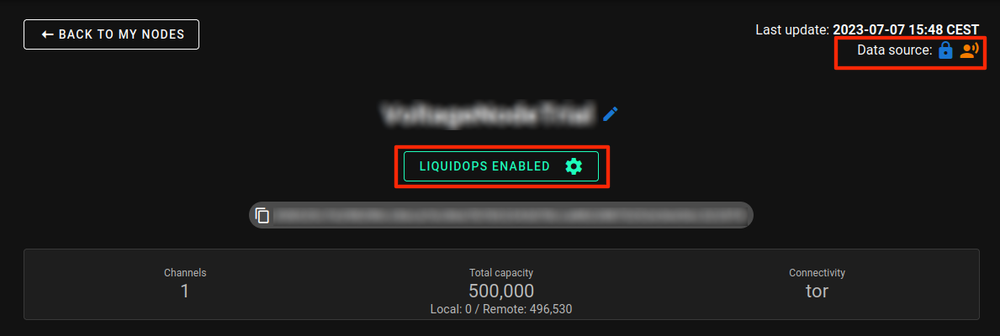

# Setup LiquidOps on Voltage nodes (agent based - push)

In order to fully leverage the capabilities of LiquidOps with a Voltage node, it is essential to utilize our open source [agent](https://github.com/bolt-observer/agent). Since Voltage does not support direct installation of bolt.observer, the recommended approach is to install the agent on a separate server, which can seamlessly operate alongside a Voltage node.

### Recommended setup

In this tutorial, we will explain how to configure our open-source agent to work with a Voltage node. Refer to the chart below for a visual representation:

<figure><figcaption><p>Agent and Lightning node running on separate machines </p></figcaption></figure>

Machine 1: Voltage node

Machine 2: a secondary server  where the agent can be installed&#x20;


For the agent installation, you can find more information in [agent-based-push.md](../liquidops/setup-liquidops/agent-based-push.md "mention") and in the [repository](https://github.com/bolt-observer/agent#install).

### Voltage setup

LiquidOps provides extensive automation capabilities for a wide array of operations, including connectivity, node status notifications, and liquidity management through [auto swaps](../liquidops/node-and-liquidity-automation.md). Liquidity management specifically requires on-chain and off-chain permissions, as well as access to addresses, invoices, and read/write permissions.

<figure><figcaption></figcaption></figure>

After logging into your Voltage account, navigate your "**home**" page. Scroll down the page and download the **Admin macaroon** and the **TLS certificate** onto the machine where you plan to install the agent. In this case, it would be Machine 2, as mentioned in the previous instructions[#agent-setup](setup-liquidops-on-voltage-nodes-agent-based-push.md#agent-setup "mention").

### Agent installation

Install the agent by following the instructions under github [repository](https://github.com/bolt-observer/agent#install).

### Agent options

Ensure the following options are properly configured in the agent:&#x20;

#### Apikey

Log into your account on bolt.observer, and from your node page and click on "**Enroll in LiquidOps**"

<figure><figcaption><p>LiquidOps setup with agent</p></figcaption></figure>

Generate an API key and copy its value.&#x20;

<figure><figcaption></figcaption></figure>

Add the API key as an option in your command line:

<figure><figcaption></figcaption></figure>

<pre><code><strong>--apikey a3fxxxxxxxxxxxxxxxxxxxxxxxxxx
</strong></code></pre>

#### Macaroon path

Specify the path to the admin macaroon file using the following option:

<pre><code><strong>--macaroonpath /some/path/to/file.macaroon
</strong></code></pre>

#### TLS Certificate path

Specify the path to the TLS certificate file using the following option:

```
--tlscertpath /some/path/to/tls.cert
```

#### RPC server

Set the RPC server address using the following option:

```
--rpcserver demo.m.voltageapp.io:10009
```

The complete command line with all options is shown below:


```
bolt-agent --apikey a3fxxxxxxxxxxx --macaroonpath /some/path/to/file.macaroon --tlscertpath /some/path/to/tls.cert --rpcserver demo.m.voltageapp.io:10009
```


<figure><figcaption><p>Command line agent configuration</p></figcaption></figure>

For additional options&#x20;

### Verification

Once the bolt-agent is running correctly, refresh your node page, and you should see "LiquidOps enabled" and the data source displayed in the top right corner of the page.

<figure><figcaption></figcaption></figure>

From this point, you can [create-a-workflow-with-auto-swaps.md](create-a-workflow-with-auto-swaps.md "mention") and starts enjoying the benefits of LiquidOps.
