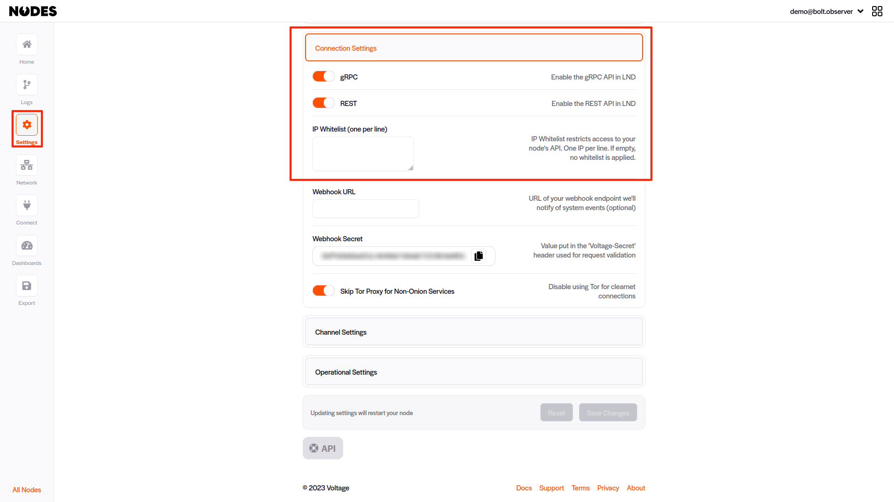
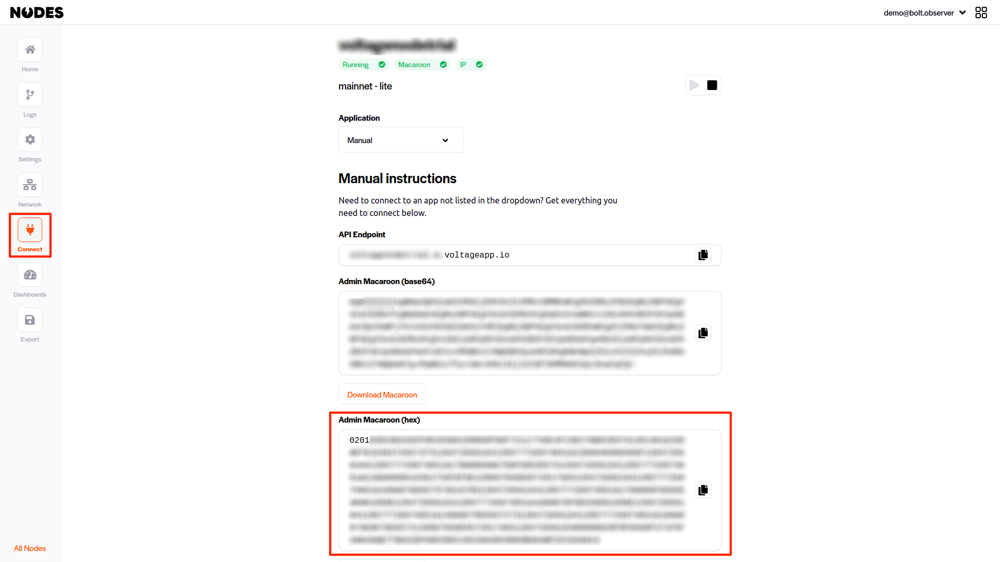
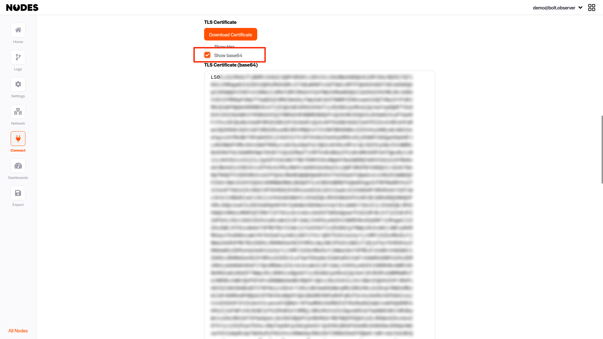
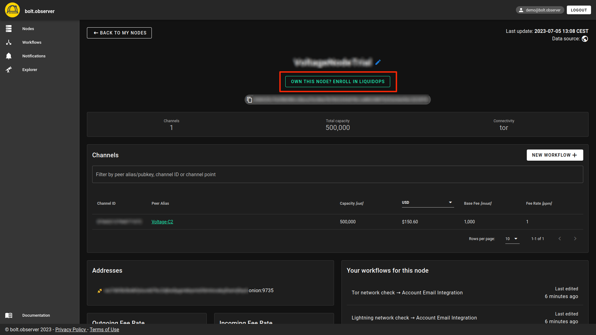
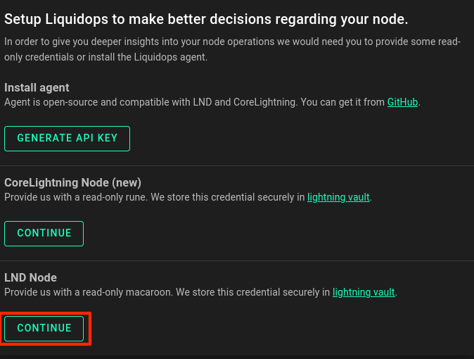
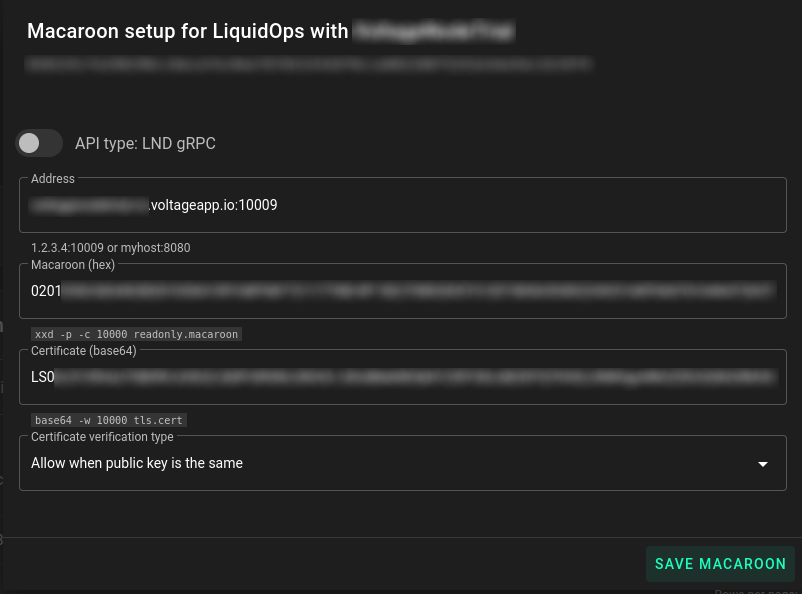
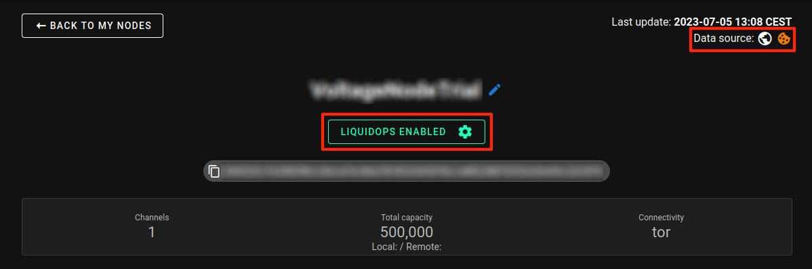

# Setup LiquidOps on Voltage nodes (API based - pull)

### Setup in Voltage

After logging into your Voltage account, navigate the left side menu and click on "Settings". Scroll down to the "Connect Settings" section&#x20;

* Ensure that gRPC is enabled.
* If you are using the IP Whitelist feature, include the following IP addresses:
  * 34.170.53.37
  * 34.70.20.229

<figure><figcaption>
LiquidOps on Voltage node: <strong>Readonly Macaroon (hex)</strong> 
</figcaption></figure>

Next, navigate to the **Connect** page from the left side menu.&#x20;

In the **Application** menu, choose **Manual** option. You are invited to copy **API Endpoint**, **Readonly Macaroon (hex)** and **TLS Certificate:**

#### **API Endpoint**&#x20;

In this example, the API Endpoint is "**demo.m.voltageapp.io**". Make a note of this value.

#### **Readonly Macaroon (hex)**

&#x20;Copy the entire content of the field. In our case, the readonly macaroon starts with "0201."

<figure><figcaption>
LiquidOps on Voltage node: <strong>Readonly Macaroon (hex)</strong> 
</figcaption></figure>

#### **TLS Certificate**&#x20;

Scroll down the page and locate the TLS Certificate section. Select the option to "Show base64" and make a copy of the value. In our case the TLS certificate starts with "LS0..."

<figure><figcaption></figcaption></figure>

### Setup in Bolt.Observer

Log into your account at [bolt.observer](https://bolt.observer/), and add your Voltage node to the **Node page** either by entering the alias or the pubkey. Read [getting-started.md](../liquidops/getting-started.md "mention") for more details on how add your first node.


When adding a new node to bolt.observer, please ensure that you wait for a duration of 10 minutes after its creation in Voltage. This waiting period is necessary to allow the node to be visible on the graph and successfully added to the platform.


Then click on Go to Node as shown below

<figure><figcaption>
Setup LiquidOps 
</figcaption></figure>

On your node page, setup LiquidOps by clicking on "Enroll in LiquidOps"

<figure><figcaption></figcaption></figure>

In the subsequent menu, click **CONTINUE** under LND Node.

<figure><figcaption></figcaption></figure>

Now, you need to provide the following values obtained earlier:

* In the field **Address,** paste the [#api-endpoint](setup-liquidops-on-voltage-nodes-api-based-pull.md#api-endpoint "mention")and add ":10009" in the end. In our example, he Address should have the following format demo.m.voltageapp.io:10009
* In the field **Macaroon(hex)**, paste the [#readonly-macaroon-hex](setup-liquidops-on-voltage-nodes-api-based-pull.md#readonly-macaroon-hex "mention")
* In the field **Certificate,** paste the [#tls-certificate](setup-liquidops-on-voltage-nodes-api-based-pull.md#tls-certificate "mention")
* In the field **Certificate verification type,** select the option **Allow when public key is the same.**  Voltage uses a short-lived Let's Encrypt certificate, by selecting this option you will avoid manual updates of the TLS certificate.

<figure><figcaption></figcaption></figure>

Once macaroons are configured, you will get the confirmation that LiquidOps is enabled as follows: &#x20;

<figure><figcaption></figcaption></figure>
