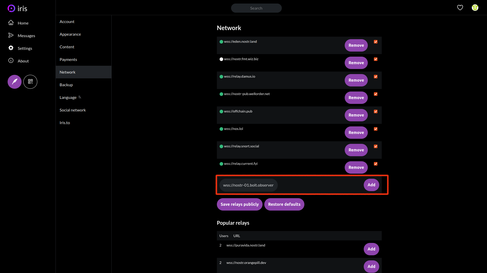
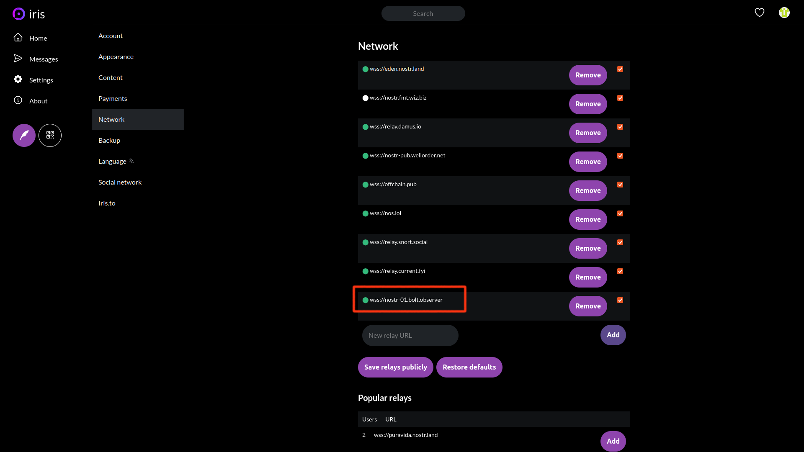
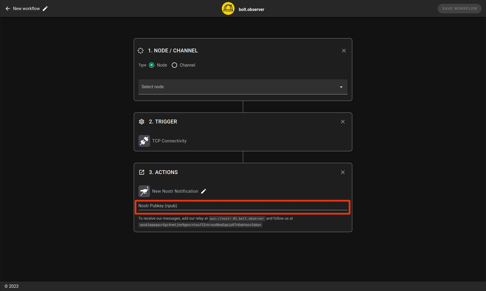
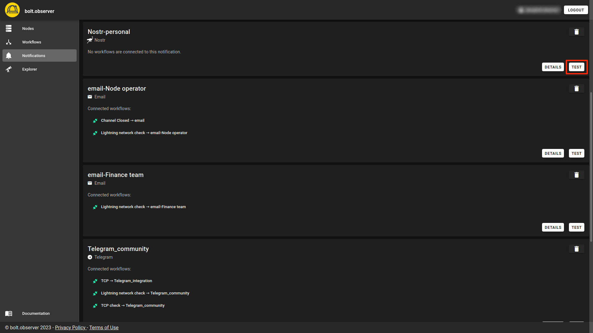
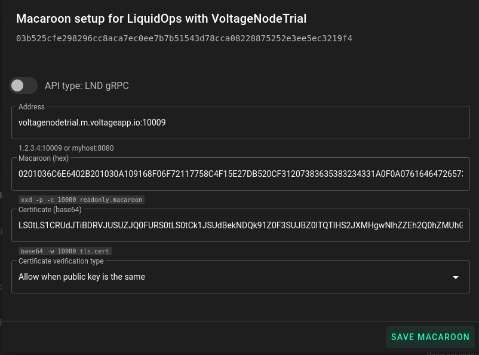

# Nostr

### Prerequesites

Include our relay by connecting to `wss://nostr-01.bolt.observer` on your nostr client. Here is an example taken from an iris.to:

<figure><figcaption><p>nostr setup: Add a relay</p></figcaption></figure>

In Settings > Network, add bolt.observer relay and click **Add**. Don't forget to click on **Save relays publicly** button.

<figure><figcaption><p>nostr setup: add a relay</p></figcaption></figure>

Lastly, make sure to follow the _bolt.observer alerts_ account with the `npub1qqqqqur6gc4nmtjke9gpncntwuf32xkrwud8wq5gwjp07n6qkhasv5qkpv` pubkey.

<figure><figcaption><p>nostr setup: follow account</p></figcaption></figure>

### Setup

There are two ways to create nostr notifications on bolt.observer. The first option is during the [workflow creation](nostr.md#workflow-with-notification-on-nostr). Alternatively, you can also create notifications on the [Notification page](nostr.md#notification-page).&#x20;

#### Option 1: Workflow with notification on nostr

When creating a workflow on bolt.observer, enter your nostr public key in npub format in the designated "Nostr Pubkey (npub)" field as shown below:

<figure><figcaption><p>Nostr integration</p></figcaption></figure>

Don't forget to click on **Save Workflow.**&#x20;

#### Option 2: Notification page

In the notification page, click on **Add notification**

<figure><figcaption><p>Nostr notification setup</p></figcaption></figure>

Select nostr as a notification type as illustrated below:&#x20;

<figure><figcaption><p>Nostr notification setup</p></figcaption></figure>

Enter your account's pubkey and click on **Save**.

<figure><figcaption></figcaption></figure>

### Test

To perform a test on your recently created nostr notification, navigate to the Notifications page and click on the Test button associated with your notification.

<figure><figcaption></figcaption></figure>

You will receive an alert test notification in your nostr DMs.

<figure><figcaption></figcaption></figure>

```
```
