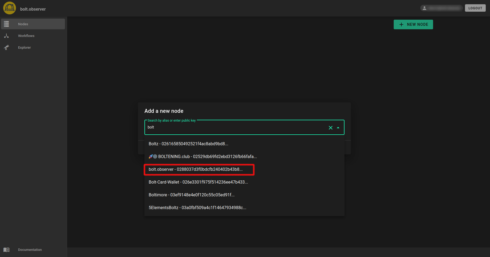
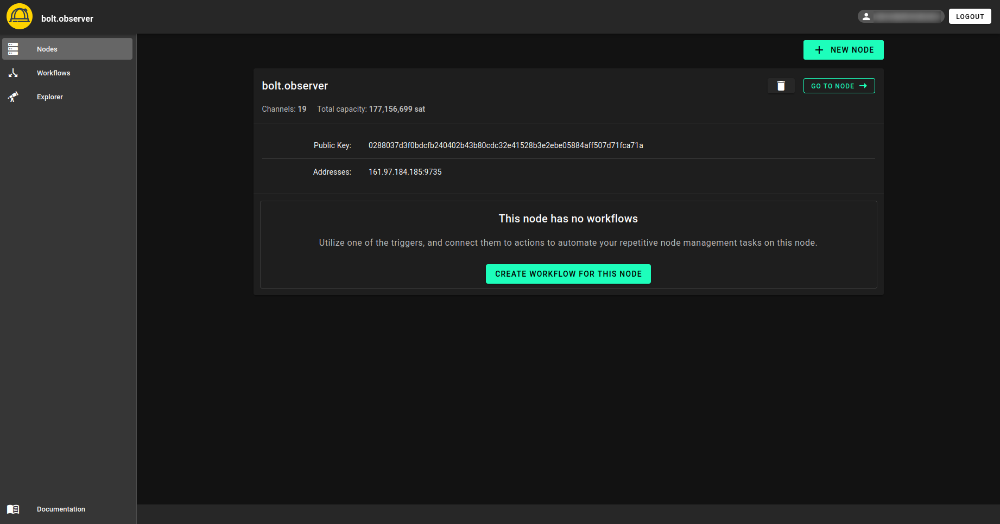

# Getting started

Let's start by adding a node. To do this, go to your node page and click on the "+ New Node" button as shown in the image below.

<figure><figcaption></figcaption></figure>

Once you have identified the node based on its pubkey or alias, click on the "Add node" button. However, if you are adding private nodes (i.e., nodes without announced channels), you'll need to use the pubkey to add them. Here's a snapshot of the process:

<figure><figcaption></figcaption></figure>

It's worth noting that the dashboard displayed below only showcases public data collected from the gossip network, such as public channels, total capacity, PubKey, addresses, and so on. To access private data and leverage advanced functionalities, we strongly recommend [setting up LiquidOps.](#user-content-fn-1)[^1] This will allow you to unlock a host of additional features and insights.

<figure><figcaption></figcaption></figure>

Once you've added your first node, you can either continue adding more nodes or start creating workflows.

[^1]: 
