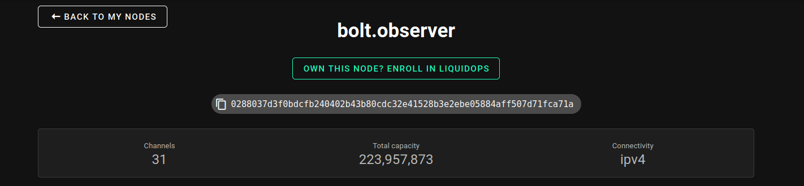
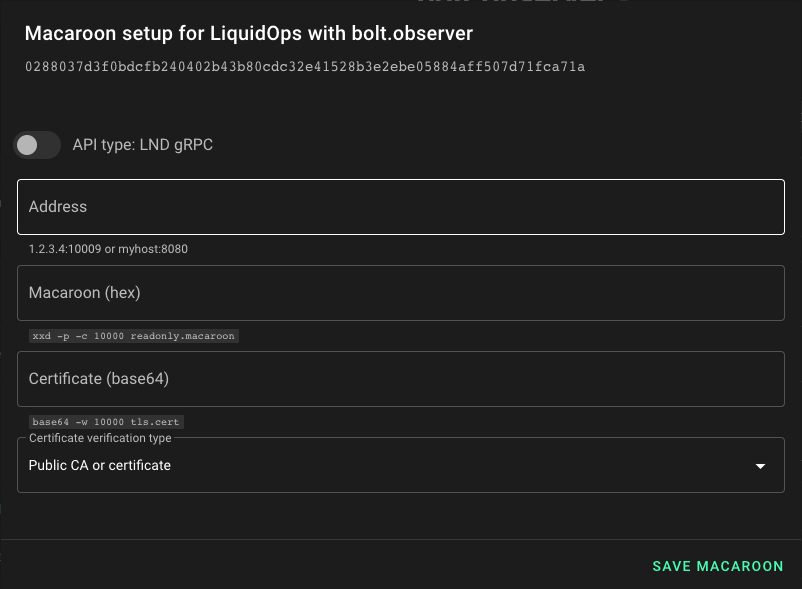
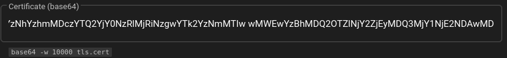

# Guide

Prerequisites:

* RPC or REST reachable from our addresses (3.233.3.134, 54.173.247.208)

Our nodes are connecting from 3.233.3.134 and from 54.173.247.208, so make sure you have those IPs whitelisted and that they can access LND API. We support both gRPC (usually on TCP port 10009) and REST API (usually running on TCP port 8080), so either of them should be enough (we prefer gRPC though).


### Enroll your node

Click on the button “Enroll in LiquidOps” to initiate the configuration

<figure><figcaption></figcaption></figure>

In the next step you have to enter node connection details&#x20;

<figure><figcaption></figcaption></figure>

On LND nodes, macaroon files can be found under `~/.lnd/data/chain/bitcoin/mainnet`.&#x20;

By default, the **readonly.macaroon** file is binary. We will convert it into an hexadecimal format with the command xxd.

`cd ~/.lnd/data/chain/bitcoin/mainnet`

`xxd -p -c 10000 readonly.macaroon`

The command returns an hexadecimal string.

`0201036c6e640224030a10f1c3ac8f073a46b6474e24b780a96c3f1201301a0c0a04696e666f12047265616400022974696d652d6265666f726540283032322d30382d30385430383a31303a30342e38383933303336335a00020e69706164647220312e322e332e34000006201495fe7fe048b47ff26abd66a56393869aec2dcb249594ebea44d398f58f26ec`

Copy the hexadecimal string returned by the command and paste in into the macaroon field:

<figure><figcaption></figcaption></figure>

`Then do the same with certificate which we first need to convert to base64`

```
cd ~/.lnd
base64 -w 10000 tls.cert
```

<figure><figcaption></figcaption></figure>

Now you need to configure  the api endpoint

<figure><figcaption></figcaption></figure>

If all the information inserted was correct you now press "**save macaroon**" button and you will see LiquidOps enabled for your node

<figure><figcaption></figcaption></figure>

You should see the data being pulled from your node briefly and extra options unlocked to create new alerts under **Manage alerts**
