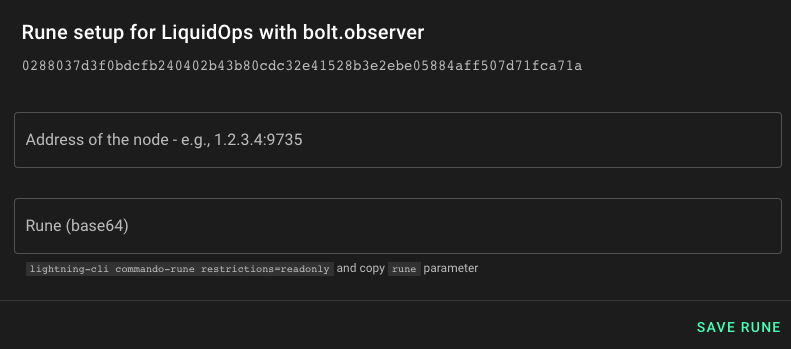

# Api based - pull

Prerequisites:

* API reachable from our IP addresses (3.233.3.134, 54.173.247.208)

You need to have those IPs whitelisted. For LND we support both gRPC (usually on TCP port 10009) and REST API (usually running on TCP port 8080), so either of them should be enough (we prefer gRPC though).
For CoreLightning we use `commando` so only lightning port (TCP 9735) should be reachable from our IPs (usually is is open for everyone already since else nobody can open a channel with your node).

### Enroll your node

Click on the button “Enroll in Liquidops” to initiate the configuration

<figure><figcaption></figcaption></figure>

In the next step you can choose how you want to enroll your node:

<figure><figcaption></figcaption></figure>

Click "Continue" for either "CoreLightning Node" or "LND Node".

In the next step you have to enter node connection details&#x20;

### LND

<figure><figcaption></figcaption></figure>

On LND nodes, macaroon files can be found under `~/.lnd/data/chain/bitcoin/mainnet`.&#x20;

By default, the **readonly.macaroon** file is binary. We will convert it into an hexadecimal format with the command xxd.

`cd ~/.lnd/data/chain/bitcoin/mainnet`

`xxd -p -c 10000 readonly.macaroon`

The command returns an hexadecimal string.

`0201036c6e640224030a10f1c3ac8f073a46b6474e24b780a96c3f1201301a0c0a04696e666f12047265616400022974696d652d6265666f726540283032322d30382d30385430383a31303a30342e38383933303336335a00020e69706164647220312e322e332e34000006201495fe7fe048b47ff26abd66a56393869aec2dcb249594ebea44d398f58f26ec`

Copy the hexadecimal string returned by the command and paste in into the macaroon field:

<figure><figcaption></figcaption></figure>

`Then do the same with certificate which we first need to convert to base64`

```
cd ~/.lnd
base64 -w 10000 tls.cert
```

<figure><figcaption></figcaption></figure>

Now you need to configure  the api endpoint

<figure><figcaption></figcaption></figure>

If all the information inserted was correct you now press "**save macaroon**" button and you will see Liquidops enabled for your node

### CoreLightning

<figure><figcaption></figcaption></figure>

For CLN you just need node address and a read-only rune. Rune can be obtained using `lightning-cli commando-rune restrictions=readonly` on your CLN node and copying `rune` field.
Note that doing this will automatically enable `commando` plugin.

An example rune looks like this:

`KUhZzNlECC7pYsz3QVbF1TqjIUYi3oyESTI7n60hLMs9MA==`

Copy your value to Rune input and press **save rune** button.

### Liquidops enabled

After saving the data you should see:

<figure><figcaption></figcaption></figure>

and the data being pulled from your node briefly and extra options unlocked to create new alerts under **Manage alerts**
