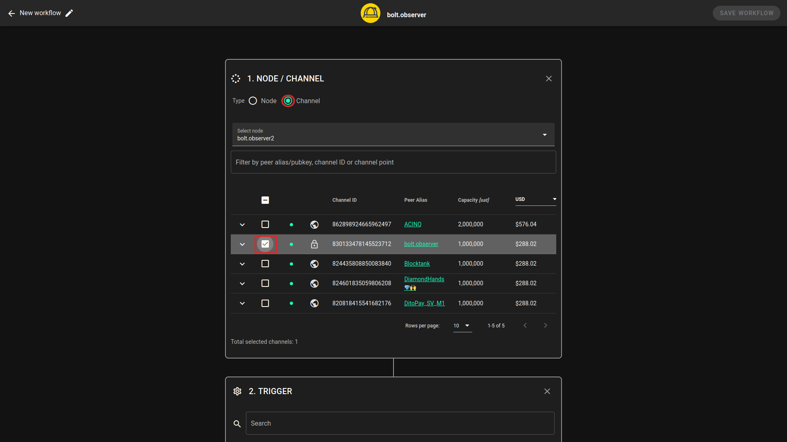

# Node and liquidity automation

## Overview

Managing a Lightning Network node can be time-consuming, requiring manual tasks to be performed regularly. Workflows simplify node and liquidity management by providing a solution to automate tasks based on predefined triggers and actions without the need for coding skills. This documentation page provides an overview of Lightning Network node automation, including how it works and examples of workflows using triggers and actions.

### How Lightning Network Node Automation works

Triggers and actions are the two main components of a workflow, which are orchestrated as follows:

> `⚠️ WHEN`**`TRIGGER`**`becomes active, THEN perform`` `**`ACTION`**

## Create Workflows

Users can easily create workflows using a simple interface to select triggers and actions or choose from predefined templates (_coming soon_). Once a workflow is created, it can be easily activated, deactivated, or edited. Users can also monitor the status and performance of their workflows, and track triggered events for troubleshooting purposes, providing a seamless and user-friendly experience in managing their Lightning Network node automation.

### Setup a new workflow

Prerequisites: Default workflows with notifications are provided as a basic feature. However, to access more advanced workflows with liquidity management, LiquidOps needs to be enabled. Refer to “Setup LiquidOps” section for more details.

To set up a new workflow, click on the “New Workflow +” button on your node page:

<figure><figcaption>
Workflow creation LiquidOps
</figcaption></figure>

Let's take a look at an example. Say you want to receive an email notification whenever the inbound balance of a particular channel falls below 10% of its total capacity, which equates to 100,000 sats for a 1 million sat channel. In this scenario, you would simply set up the appropriate rules, and you'll be notified via email as soon as the threshold is breached.

### Step 1: Choose your node or channel

To get started, you'll need to select the node and channel(s) that you wish to work with. To do this, click on the channel radio button and choose the channel or group of channels from the drop-down menu.

<figure><figcaption>
Workflow creation LiquidOps
</figcaption></figure>

Note: Both public 🌎 and private 🔒 channels are shown in the dashboard, and both can be selected as possible targets for a workflow.

### Step 2: Choose and configure your trigger

The next step is to choose one trigger from the list of available options. For more information on the different triggers, refer to the relevant section in the documentation. To set up your workflow, select the "Channel Balance" trigger and then configure the rules by choosing the liquidity type and entering the threshold value (as a percentage). For example, if you want to be notified whenever the inbound liquidity falls below 10%, set the appropriate trigger, and you'll be alerted whenever the threshold is breached.

<figure><figcaption>
Workflow creation LiquidOps
</figcaption></figure>

### Step 3: Choose and setup your action

Choose the action for your workflow and configure it according to your requirements. In our example, we want to receive an alert by email if that trigger becomes active.

<figure><figcaption>
Workflow creation LiquidOps
</figcaption></figure>

### Step 4: Name your workflow and save

Give your workflow a name and save the settings to finalize the setup process.

<figure><figcaption>
Workflow creation LiquidOps
</figcaption></figure>

## Manage workflows

Workflows can be enabled or disabled directly from the Workflows page by switching toggle.

<figure><figcaption></figcaption></figure>

Click on Edit if you want to bring modifications to your existing workflow.
